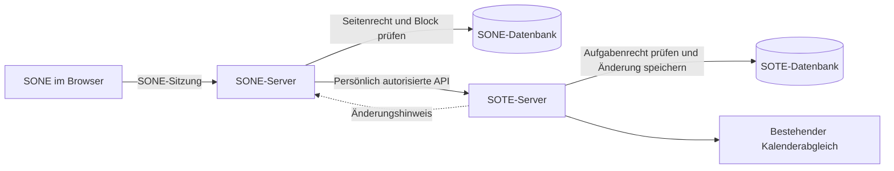

# SONE und SOTE verbinden

Stand: 13.09.2026. Konzeptvorschlag auf Basis beider lokaler Repositories, noch keine implementierte Schnittstelle. Die Empfehlungen ersetzen frühere Entscheidungen erst mit ihrer bewussten Übernahme bei der Umsetzung.

## 1. Produktidee

SONE ist der Ort für Wissen, Besprechungen und Dokumente. SOTE ist der Ort für Aufgaben, Verantwortlichkeiten, Fristen und Zeitplanung. Aufgaben lassen sich direkt im passenden Dokument bearbeiten und bleiben zugleich in SOTE auffindbar.

Beispiel: Auf der SONE-Seite „Website-Relaunch“ stehen Besprechungsnotizen und eine eingebettete Aufgabenliste. Markus erstellt dort „Startseite abstimmen“, weist sie Anna zu und setzt Donnerstag 10 Uhr mit 30 Minuten Dauer. Es entsteht eine Aufgabe in SOTE. Sie erscheint dort in den passenden Ansichten und wird gegebenenfalls über die bereits eingerichtete Kalenderverbindung übertragen. Wird sie in SOTE erledigt, aktualisiert sich der Block in SONE. Die Aufgabe enthält einen Link zurück zum richtigen Abschnitt der Besprechung.

Beide Anwendungen bleiben einzeln installierbar. Getrennte Datenbanken, Konten und Rechte bleiben bestehen. Gemeinsame Anmeldung ist möglich, aber keine Voraussetzung. Für die Verbindung wird kein zusätzlicher zentraler Dienst benötigt.

## 2. Was bereits existiert

| Grundlage | Stand im Code |
|---|---|
| SOTE-Aufgaben, Planung, Wiederholungen, Rollen, Projekte | Vorhanden; Änderungen sollen dieselben Fachfunktionen benutzen wie die SOTE-Oberfläche. |
| SOTE-Kalenderanbindung | Vorhanden; die SONE-Verbindung erzeugt reguläre Aufgaben und benötigt keinen eigenen Kalenderabgleich. |
| SOTE-Kopplungstabellen | `sone_couplings`, `sone_identities`, `task_origins` stehen bereits in Migration 0001. In den untersuchten Laufzeitpfaden ist die Verbindung noch nicht umgesetzt. |
| SONE-Editor | ProseMirror/Yjs mit stabilen Block-IDs und separaten Darstellungen eingebetteter Inhalte. |
| SONE-Rückverweise | Interne Seitenverweise und Links auf bestimmte Blöcke sind vorhanden. |
| Identität | Beide Anwendungen sind bereits OIDC-Clients. Das macht sie noch nicht zu OAuth-Servern für andere Anwendungen. |

Relevante Ausgangspunkte: SOTE `claude/konzept.md`, Abschnitte 8, 9a und „Kopplung“, `packages/server/migrations/0001_init.sql`, `packages/server/src/tasks.ts`; SONE `packages/editor/src/schema.ts`, `packages/core/src/doc/docSchema.ts`, `packages/web/src/routes/paths.ts`, `packages/server/src/http/pages.ts`, ADR-0026 und ADR-0024. Ältere READMEs beschreiben teilweise frühere Ausbaustände.

## 3. Bedienung

### Einrichtung in drei Schritten

1. **Instanzen verbinden:** Die Administration registriert die konkrete Gegenstelle mit Name und HTTPS-Adresse. In SOTE wird SONE als zugelassener Integrationsclient eingerichtet, dessen Rücksprungadresse feststeht. Der SONE-Server erhält die Client-Konfiguration. Diese Einrichtung gibt noch niemandem Aufgabenrechte.
2. **Persönliches Konto verbinden:** Unter „Deine Einstellungen → Verbundene Anwendungen“ wählt die Person „Mit SOTE verbinden“. SOTE zeigt Konto, anfragende SONE-Instanz und erlaubte Aktionen. Nach Bestätigung geht es zurück. Derselbe OIDC-Anbieter kann die Anmeldung erleichtern; die Freigabe bleibt ausdrücklich.
3. **Arbeitsbereich zuordnen:** In SONE werden das gewünschte SOTE-Arbeitsumfeld und die für Einbettungen erlaubten Projekte ausgewählt. Eine verwaltende Person braucht die entsprechende Verwaltungsberechtigung auf beiden Seiten. Die Freigabe begrenzt die Auswahl, vergibt aber keine Mitgliedschaften.

Das GUI unterscheidet „Instanz eingerichtet“, „Dein Konto verbinden“, „Verbunden“, „Zugang erneuern“ und „Verbindung getrennt“. Es zeigt insbesondere, ob die Person lesen oder auch schreiben darf. Ein Projekt, auf das sie keinen Zugriff hat, erscheint nicht mit Titel im Auswahlmenü.

### In SONE

Im `/`-Menü:

- **SOTE-Aufgabe:** Eine vorhandene Aufgabe auswählen oder eine neue im gewählten Projekt anlegen.
- **SOTE-Aufgabenliste:** Ein erlaubtes Projekt einbetten. Anfangs einfache Filter für offen/erledigt und verantwortliche Person; keine zweite freie Abfragesprache.
- **Aus Auswahl Aufgabe erstellen:** Markierten Text bewusst als Aufgabentitel übernehmen; im Dokument bleibt ein Aufgabenverweis. Beschreibungen werden nur auf ausdrückliche Auswahl mitkopiert, weil das Zielprojekt einen anderen Leserkreis haben kann.

Der Listenblock zeigt zunächst Titel, Status, zuständige Person und Planung. Datum, Uhrzeit, Ganztag, Dauer und Priorität lassen sich im vorhandenen Gestaltungssystem bearbeiten. Erweiterte Funktionen öffnen die Aufgabe in SOTE. Projekt und Leserkreis sollen vor dem ersten Anlegen erkennbar sein.

Ein normaler SONE-Checkbox-Block bleibt eine lokale Checkliste. Erst der ausdrückliche Befehl „Als SOTE-Aufgabe übernehmen“ stellt die Verbindung her. So landen Einkaufsnotizen und kleine Dokument-Checklisten nicht automatisch in der Aufgabenverwaltung.

### In SOTE

Die Aufgabendetails erhalten „Verknüpfte Notizen“. Zunächst stehen dort neutrale Links wie „Quelle in SONE öffnen“, die auf Seite und Block führen. Private Seitentitel werden nicht automatisch in ein möglicherweise breiter sichtbares SOTE-Projekt kopiert. Die Zugriffsprüfung auf das Dokument erfolgt beim Öffnen in SONE.

Eine Aufgabe kann in mehreren Dokumenten erwähnt werden. Herkunft beim Erstellen und weitere Verweise werden unterschieden. Der Status einer Aufgabe bleibt überall derselbe.

## 4. Zuordnung und Datenhoheit

Empfehlung: Ein SONE-Arbeitsbereich darf ausgewählte Projekte aus einem zugeordneten SOTE-Arbeitsbereich verwenden. Mehrere Listen auf einer Seite sind möglich. Jede Liste verweist auf genau ein Projekt und einen Filter. Dasselbe Projekt darf an mehreren Stellen eingebettet werden. Beliebige Kombinationen mehrerer Instanzen pro Block gehören nicht in den ersten Ausbau; IDs werden trotzdem immer zusammen mit der Instanz-ID gespeichert.

Die Auswahl eines bestehenden Projekts ist der Standard. „Neues Projekt erstellen“ ist eine bewusste zusätzliche Aktion mit den normalen SOTE-Rechten. Das Einfügen oder Kopieren eines Blocks erzeugt keine Projekte.

| Daten | Verantwortliches System |
|---|---|
| Titel, Beschreibung, Status, Termine, Dauer, Wiederholung, Zuweisung einer Aufgabe | SOTE |
| Notiztext, Seitenstruktur, Blockposition, Darstellung und Listenfilter | SONE |
| Projekt- und Aufgabenberechtigungen | SOTE |
| Seitenberechtigungen | SONE |
| Verbindungsfreigabe | Jeweils lokal, mit jederzeitiger Widerrufsmöglichkeit |
| Verweis zwischen Aufgabe und Block | SONE hält die Einbettung; SOTE hält einen abgleichbaren Rückverweis. |

Eine Aufgabe wird nicht zwischen zwei Datenbanken synchronisiert. SONE liest und bearbeitet dieselbe SOTE-Aufgabe über eine Schnittstelle. Globale Projektsortierung wird nur durch einen ausdrücklich dafür vorgesehenen Befehl verändert; die Darstellung im Dokument bleibt separat.

## 5. Rechte: Einbettung erweitert keinen Zugriff

Die effektive Berechtigung ergibt sich aus **SONE-Seitenrecht ∩ SOTE-Aufgabenrecht ∩ persönlicher Integrationsfreigabe ∩ erlaubtem Projekt der Kopplung**. Der SONE-Server prüft Seite und Einbettung; SOTE bestimmt den Akteur aus dem persönlichen Zugriffstoken und prüft seine aktuellen Rechte. Eine vom Browser mitgeschickte Benutzer-ID gilt nicht als Identitätsnachweis.

| Person | Ergebnis im Block |
|---|---|
| Darf SONE-Seite und SOTE-Projekt lesen | Aufgaben lesen |
| Darf in beiden schreiben und hat Schreibfreigabe erteilt | Aufgaben anlegen, ändern und erledigen |
| Darf die SONE-Seite nur lesen, aber SOTE bearbeiten | Im Dokument nur lesen; „In SOTE öffnen“ für weitere Aktionen |
| Darf die SONE-Seite lesen, aber nicht das SOTE-Projekt | Neutraler Hinweis „Kein Zugriff auf die verknüpften Aufgaben“ |
| Hat sein SOTE-Konto noch nicht verbunden | „Mit SOTE verbinden“ |
| Öffentlicher SONE-Freigabelink | Im ersten Ausbau nur neutraler Platzhalter, keine Aufgabendaten |

Angemeldete Gäste werden wie andere Konten geprüft, sofern sie in beiden Systemen berechtigt und verbunden sind. Anonyme Bearbeitungslinks werden nicht automatisch zu SOTE-Schreibberechtigungen.

### Warum keine Aufgabenkopie im Dokument?

SONE überträgt ein vollständiges Yjs-Dokument an berechtigte Seitenleser. Darin gespeicherte Aufgabentitel könnten auch Personen lesen, denen die Oberfläche den Block ausblendet. Deshalb enthält der geteilte Block nur Verbindungs-/Ressourcenreferenzen und Darstellungseinstellungen, keine Titel, Beschreibungen, Namen von Verantwortlichen oder gemeinsamen Vorschaudaten aus SOTE.

Dynamische Inhalte werden getrennt, persönlich autorisiert geladen. Dasselbe gilt für Suchindizes, Versionen, Benachrichtigungen, Vorschauen und Logs: Dort dürfen Aufgabendetails nicht unbeabsichtigt zu allgemeinen SONE-Inhalten werden. Selbst manuell eingegebene Blocküberschriften sind gewöhnlicher SONE-Seitentext und unterliegen dessen Leserkreis.

Bei Rechteentzug werden die persönlichen Ansichten verworfen und neue Anfragen abgelehnt. Bereits gelesener oder bewusst exportierter Inhalt lässt sich technisch nicht zurückholen.

## 6. Technischer Aufbau

Der Browser spricht beim Arbeiten in SONE nur mit SONE. Der Server vermittelt zur registrierten SOTE-Instanz. Dadurch bleiben Zugangstokens auf dem Server und die Integration hängt nicht von gemeinsamen Cookies, fremden Browser-Cookies oder einem iframe ab. HTTP-Anfragen zwischen den Servern sind begrenzt und dürfen nicht beliebigen URLs aus Dokumenten folgen. Für selbst betriebene interne Gegenstellen wird die konkrete Adresse administrativ freigegeben; es gibt keine allgemeine Freigabe des internen Netzes.

### Persönlicher Zugriff

Vorgeschlagen ist ein begrenzter OAuth-2.0-Autorisierungsserver in SOTE und ein Integrationsclient in SONE: Authorization Code mit PKCE, exakte Rücksprungadressen, an die SONE-Sitzung gebundener State, einmalige kurzlebige Codes und widerrufbare persönliche Grants. SOTE wird dafür kein allgemeiner OIDC-Identitätsanbieter. Die Protokollumsetzung sollte auf einer gepflegten Bibliothek beruhen und separat geprüft werden. [OAuth-Sicherheit, RFC 9700](https://www.rfc-editor.org/rfc/rfc9700.html).

Die erste Freigabe erlaubt nur Projekt-/Aufgabenlesen, optional Erstellen und Bearbeiten sowie das Pflegen eigener Verweise. Keine Benutzerverwaltung, keine Freigaben und kein Löschen über diese Oberfläche. Der Grant wird auf die ausgewählten Projekte begrenzt; die aktuellen Projektrollen werden trotzdem bei jeder Anfrage geprüft. SOTE speichert Tokenprüfwerte; SONE muss die verwendbaren Tokens verschlüsselt speichern. Widerruf ist in beiden persönlichen Einstellungen erreichbar. Eine Änderung des Passworts oder Rechteentzug folgt einer ausdrücklich festgelegten Token-Widerrufsregel.

Gleiche E-Mail-Adressen genügen nie zur Kontoverknüpfung. Auch derselbe OIDC-Anbieter garantiert nicht dieselbe `sub` für verschiedene Clients, weil paarweise Subjektkennungen möglich sind. Deshalb erfolgt die Kontoverbindung über den bestätigten Flow; SSO reduziert nur die nötigen Anmeldeschritte. [OpenID Connect: Subject Identifier Types](https://openid.net/specs/openid-connect-core-1_0.html#SubjectIDTypes).

### Vorgeschlagener API-Vertrag v1

Die Namen sind Entwurf, keine bestehenden Endpunkte:

| Endpunktgruppe in SOTE | Zweck |
|---|---|
| `/api/integrations/v1/capabilities` | Protokollversion und unterstützte Funktionen, ohne Personendaten |
| `/oauth/authorize`, `/oauth/token`, `/oauth/revoke` | Persönliche Zugriffsfreigabe und Widerruf |
| `GET /api/integrations/v1/projects` | Erlaubte Projekte der verbundenen Person |
| `GET /api/integrations/v1/projects/:id/tasks` | Paginierte Aufgaben mit begrenzten Filtern und Revisionen |
| `POST /api/integrations/v1/projects/:id/tasks` | Aufgabe anlegen, mit eindeutiger Operations-ID |
| `PATCH /api/integrations/v1/tasks/:id` | Gezielt Felder setzen; erwartete Revision mitsenden |
| `PUT /api/integrations/v1/tasks/:id/references/:referenceId` | Eigenen Herkunfts-/Erwähnungslink idempotent hinterlegen |
| `DELETE /api/integrations/v1/tasks/:id/references/:referenceId` | Nur diesen Verweis lösen |
| `GET /api/integrations/v1/changes?cursor=…` | Berechtigte Änderungen nachholen |

SONE erhält lokale Vermittlungsrouten unter `/api/integrations/sote/…`. Bei jeder Operation muss die Seite noch zugänglich sein, der Block zur Seite gehören und das Projekt zur zugelassenen Zuordnung passen. Nicht nur die UI-Auswahl prüft diese Bedingungen. Änderungen werden mit lokalem SOTE-Akteur und Herkunft „SONE“ protokolliert; bestehende Benachrichtigungen und Wiederholungslogik laufen normal weiter.

### Konflikte und Aktualisierung

- SOTE-Aufgaben erhalten eine monoton steigende Revision, die bei allen relevanten Schreibwegen mitgeführt wird. Eine Prüfung nur bei Integrationsaufrufen wäre unzureichend.
- Änderungen senden die gelesene Revision, beispielsweise als ETag mit `If-Match`. Bei veraltetem Stand liefert der Server einen Konflikt. SONE zeigt den aktuellen Inhalt und erhält den ungespeicherten Entwurf. Kein stilles Überschreiben. [HTTP-Vorbedingungen, RFC 9110](https://www.rfc-editor.org/rfc/rfc9110.html#name-if-match).
- „Erledigt setzen“ und „Wieder öffnen“ sind ausdrückliche Zustände, kein wiederholbarer Toggle. Eine verlorene Antwort darf insbesondere keine zweite Wiederholungsaufgabe erzeugen.
- Erstellen verwendet eine dauerhaft zuordenbare Operations-ID je Client und Nutzer. Wiederholung nach Timeout liefert dasselbe Ergebnis; dieselbe ID mit anderem Inhalt wird abgewiesen. Vor Wiederholung wird der Ausgang der ersten Operation geklärt.
- Zuerst genügt ein persönlicher Abruf beim Öffnen, nach Änderungen und in einem kurzen Intervall bei sichtbarer Seite. Ausgeblendete Tabs reduzieren die Abrufe.
- Im nächsten Schritt meldet SOTE Änderungen über authentifizierte Webhooks. Die Nutzdaten enthalten nur gebundene Ressourcenkennungen und Revisionen, keine Aufgabentexte. SONE lädt anschließend für jede berechtigte Person neu. Geteilte SONE-Echtzeitkanäle bekommen keine persönlichen Aufgabenpayloads.
- Webhooks haben Signatur, Zeitstempel, Ereignis-ID, Wiederholungen mit Backoff sowie deduplizierten Empfang. Transaktionale Outbox verhindert verlorene Ereignisse zwischen Datenänderung und Versand. Ein Cursor-Abgleich fängt Ausfälle ab; abgelaufene Cursor führen zu einem berechtigten Neuabruf.

## 7. Datenmodell und Lebenszyklus

Die vorhandenen Tabellen sind ein Ausgangspunkt, reichen in ihrer jetzigen Form aber nicht:

| Baustein | Inhalt |
|---|---|
| Registrierte Gegenstellen | Stabile Instanz-ID, Basisadresse, Client-Zuordnung, Protokollfähigkeiten, Aktiv-/Widerrufsstatus |
| Persönliche Verbindungen | Lokale und entfernte Konto-ID, Gegenstelle, Grant/Scopes, verschlüsselte Tokens beim Client, Widerruf |
| Projektzuordnungen | SONE-Arbeitsbereich, SOTE-Arbeitsbereich/Projekt, bestätigende Personen und Zeitpunkt; mehrere Projekte je SONE-Arbeitsbereich |
| Einbettungen in SONE | Seite, Block-ID, Typ Einzelaufgabe/Liste, Gegenstelle, Aufgabe/Projekt, Filter; keine SOTE-Inhaltskopie |
| Verweise in SOTE | Aufgabe, Gegenstelle, Seiten-/Block-ID, Herkunft oder Erwähnung; mehrere je Aufgabe |
| Operations- und Ereignisprotokoll | Idempotenz, Ergebniszuordnung, Outbox, Zustellung, Cursor |

Die alten Eins-zu-eins-Constraints von `sone_couplings` und der einzelne Rückverweis je `task_origins.task_id` werden über neue Migrationen erweitert oder kontrolliert in neue Tabellen überführt. Migration 0001 wird nicht nachträglich verändert. Vorher prüfen, ob reale Altdaten existieren. Eine bestehende Freigabe darf bei der Migration nicht automatisch auf mehr Projekte oder Personen ausgeweitet werden.

Der SONE-Block muss in Editor-Schema, persistiertem Dokumentformat, Materialisierung und Import/Export konsistent ergänzt werden. Block-/Einbettungsregistrierung wird serverseitig gegen den bestätigten Dokumentstand geprüft. Ein Client darf keine fremde Block-ID als Begründung für eine Aufgabenänderung angeben.

| Ereignis | Verhalten |
|---|---|
| Block oder SONE-Seite gelöscht | Einbettung/Verweis wird entfernt oder als nicht mehr aktiv markiert; Aufgabe und Projekt bleiben in SOTE. |
| Löschen in SONE rückgängig gemacht | Derselbe Block kann dieselbe Ressource wieder anzeigen, sofern Rechte und Verbindung noch bestehen. |
| Block kopiert | Neue Block-ID, dieselbe Aufgabe beziehungsweise Projektansicht; keine Aufgabe wird dupliziert. |
| Block in anderen Arbeitsbereich verschoben | Kopplung und Seitenrechte neu prüfen; bei fehlender Zuordnung nur Platzhalter. |
| Aufgabe in anderes SOTE-Projekt verschoben | Aktuelle Rechte und erlaubte Projekte erneut prüfen; außerhalb der Kopplung keine weiteren Details anzeigen. |
| Aufgabe gelöscht | Berechtigte Nutzer sehen „Im Papierkorb“, ohne Rechte neutral „Nicht verfügbar“. |
| Verbindung getrennt | Tokens widerrufen, persönliche Inhalte verwerfen; Dokument behält einen neutralen wiederverbindbaren Verweis. |
| Gegenstelle nicht erreichbar | „SOTE derzeit nicht erreichbar“, Schreibaktionen gesperrt. Bereits sichtbarer Inhalt wird als nicht aktuell markiert; kein geteilter dauerhafter Offline-Cache im ersten Ausbau. |
| Erstellen erfolgreich, Einbettung danach fehlgeschlagen | Operations-ID ermöglicht „Vorhandene Aufgabe wieder einfügen“. Keine automatische Löschung als Kompensation. |
| Dokument-Backup/Versionswiederherstellung | Nur Referenzen werden wiederhergestellt; Aufgabenstatus und Termine in SOTE werden nicht zurückgesetzt. |

Das Anlegen ist ein über zwei Systeme verteilter Vorgang: Einbettung vorbereiten, Aufgabe idempotent erstellen, Verweis abschließen. Jeder Schritt hat einen wiederaufnehmbaren Zustand. Ein Timeout darf weder stillen Erfolg vortäuschen noch bei erneutem Klick eine zweite Aufgabe erzeugen.

Exporte enthalten standardmäßig einen Hinweis und einen stabilen Ressourcenlink ohne Zugangstoken. Ein späterer Befehl „Als statische Liste exportieren“ darf nach persönlicher Berechtigungsprüfung eine bewusste Inhaltskopie erzeugen. Diese Kopie wird als Stand mit Datum gekennzeichnet und unterliegt danach den Rechten des Exportziels; sie ist keine widerrufbare Live-Einbettung. Tokens und öffentliche Freigabeschlüssel werden nicht im Dokument gespeichert.

## 8. Bewusste Änderungen gegenüber dem frühen Entwurf

1. **Mehrere Projekte statt einer starren Eins-zu-eins-Kopplung.** Die zulässige Projektmenge bleibt ausdrücklich begrenzt.
2. **Persönliche Rechte statt automatischer Rechteübernahme.** Eine SONE-Seitenfreigabe gibt keine SOTE-Projektrechte. Bequeme gemeinsame Gruppenverwaltung kann später separat hinzukommen.
3. **Keine gemeinsame Anzeigekopie in Yjs.** Der frühere Offline-Vorschlag verträgt sich nicht mit unterschiedlichen Leserechten. Im ersten Ausbau zählt die korrekte Zugriffsgrenze.
4. **Trennen lässt einen neutralen Verweis stehen.** Automatische Umwandlung in Klartext würde fremde Aufgabeninhalte dauerhaft im Dokument festhalten. Statische Kopien werden ein eigener bewusster Exportvorgang.
5. **SSO ist keine automatische Kontozuordnung.** Die persönliche Autorisierung wird weiterhin benötigt.
6. **Projektanlage ist ausdrücklich.** Eine zweite Liste auf einer Seite braucht nicht automatisch ein zweites Projekt.

## 9. Umsetzung in vier Etappen

### A — Erste vollständig nutzbare Verbindung

Instanzregistrierung, persönliche Autorisierung, Projektzuordnung, Einzelaufgabe und einfache Liste im SONE-Editor. Neue Aufgaben aus einer Notiz anlegen, Titel/Planung/Dauer bearbeiten, erledigen und wieder öffnen; Link zur Quelle in SOTE. Rechteprüfung, Idempotenz, Konflikte, neutrale Fehlerzustände und Abgleich sichtbarer Blöcke gehören bereits dazu. Kein öffentliches Einbetten, kein stiller Offline-Schreibpuffer und kein automatischer Projektgenerator.

Ein sinnvoller Demonstrationsfall ist eine Besprechungsseite mit drei Aufgaben, die zwei Personen gemeinsam benutzen. Beide können anschließend unabhängig in SOTE weiterarbeiten. Das Löschen des Dokuments lässt die Aufgaben unberührt.

### B — Bequemlichkeit und Aktualität

Webhooks/Outbox, mehrere Quellen pro Aufgabe, zusätzliche Filter, platzsparende Details, bessere Auswahl aus bestehenden Aufgaben und optional bewusste Projektanlage. Nach Rückkehr in einen Tab wird der Stand sofort geprüft.

### C — Kontext in beide Richtungen

SONE-Seiten in SOTE auswählen und persönlich autorisierte Vorschauen anzeigen. Dafür benötigt auch SONE eine entsprechende delegierte Leseschnittstelle; ein dauerhaft privilegierter Instanzschlüssel genügt nicht. Optional gemeinsame Suche mit getrennten, pro Person berechtigten Treffern. SONE-Kalenderblöcke können dann SOTE-Ansichten darstellen, ohne externe Kalenderkonten erneut zu verbinden.

### D — Gemeinsamer Komfort

Gezielte gemeinsame Gruppen-/Einladungsabläufe, externe lesende Veröffentlichung mit eigener Freigabe, Apps mit Links direkt zu Aufgabe und Ursprungsnotiz. Offline-Bearbeitung bekommt ein eigenes Konzept für lokalen Speicher, Kontotrennung, Wiederholungen und Konflikte. Sie wird nicht nebenbei als Warteschlange ergänzt.

## 10. Abnahmekriterien

- Eine Aufgabe aus einer SONE-Notiz erscheint genau einmal in SOTE, einschließlich Zeitpunkt, Dauer und Quelle.
- Änderungen aus beiden Oberflächen aktualisieren dieselbe Aufgabe; bestehende Kalenderübertragung funktioniert ohne Sonderpfad.
- Zwei Personen mit verschiedenen Rechten sehen auf derselben Seite jeweils nur ihre erlaubten Inhalte. Seitenleser ohne SOTE-Zugriff finden auch in Yjs, Export, Suche und Versionsdaten keine fremden Aufgabentitel.
- Öffentliches Teilen einer SONE-Seite veröffentlicht keine SOTE-Aufgaben.
- Gleichzeitiges Bearbeiten, doppelte Requests, verlorene Antworten und Erledigen einer Serienaufgabe erzeugen weder stillen Datenverlust noch Duplikate.
- Entzug von Projekt-, Seiten- oder Tokenrechten wirkt auf weitere Zugriffe. Verschieben, Kopieren, Wiederherstellen und Trennen erweitern keine Rechte.
- Löschen einer Notiz, eines Blocks oder einer Kopplung löscht niemals Aufgaben oder Projekte.
- Unterschiedliche, kompatible App-Versionen funktionieren; inkompatible Versionen zeigen einen verständlichen Hinweis und deaktivieren nur die Verbindung.
- Ein frischer Betreiber kann beide Instanzen anhand der Dokumentation verbinden, ohne direkten Datenbankzugriff oder einen zusätzlichen Integrationsdienst.

**Empfehlung:** Mit Etappe A beginnen. Ihr Nutzen ist bereits ein vollständiger Arbeitsablauf von der Besprechungsnotiz zur geplanten Aufgabe. Die wichtigste Architekturentscheidung ist, Aufgaben ausschließlich in SOTE zu führen und ihre Anzeige in SONE persönlich zu autorisieren.
